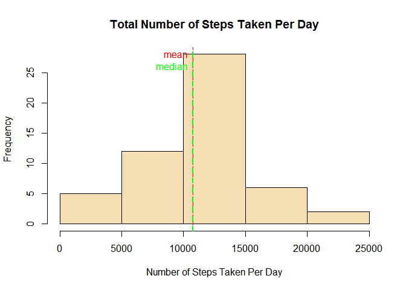
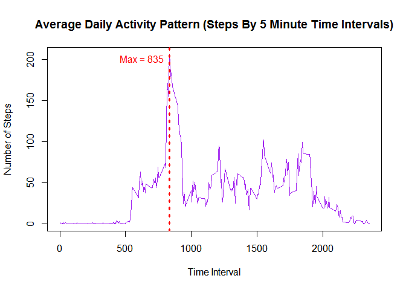
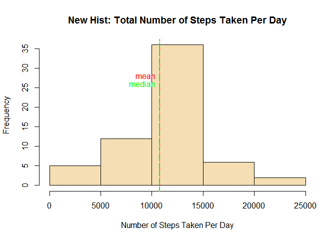
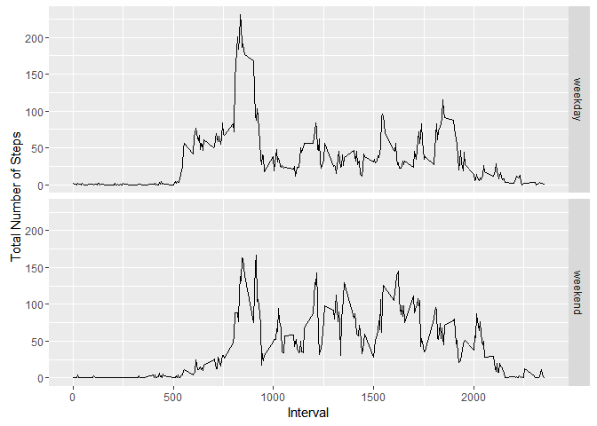

# Reproducible Research: Peer Assessment 1


## Loading Data
##### Data set is unpacked from the zip file and loaded into R.

```r
if(!file.exists(".\\activity.csv")) {
  unzip("C:\\ProgSQ\\R\\RepData_PeerAssessment1\\activity.zip")
}

df <- read.csv(".\\activity.csv")
```
## Data Pre-Processing
##### Data is pre-processed by removing data with NA values.

```r
df2 <- na.omit(df)
```
## What is mean total number of steps taken per day?
##### The results are:

* Mean = 10,766 steps per day
* Median = 10,765 steps per day


```r
spd_sum <- aggregate(steps ~ date, df2, sum)
steps_mean <- mean(spd_sum$steps)
steps_median <- median(spd_sum$steps)

hist(spd_sum$steps, main = title("Total Number of Steps Taken Per Day"), xlab = "Number of Steps Taken Per Day", col = "wheat")
abline(v=steps_mean, lty = 5, col = "red")
abline(v=steps_median, lty = 2, lwd = 2, col = "green")
text(steps_mean, 28, labels = "mean", pos = 2, col = "red")
text(steps_median, 26, labels = "median", pos = 2, col = "green")
```

\


## What is the average daily activity pattern?
##### The average daily activity pattern:
* Time series plot (see below).
* The interval with the most steps is 835.

```r
steps_int <- aggregate(steps ~ interval, df2, mean)
plot(steps_int$interval,
     steps_int$steps,
     type = "l",
     main = "Average Daily Activity Pattern (Steps By 5 Minute Time Intervals)",
     xlab = "Time Interval",
     ylab = "Number of Steps",
     col = "purple")
abline(v=steps_int[which.max(steps_int$steps),1], lty = 3, lwd = 3, col = "red")
text(steps_int[which.max(steps_int$steps),1], 200, pos = 2, labels = "Max = 835", col = "red")
```

\


## Imputing missing values
##### The number of missing values is 2,304.

```r
nMissing <- sum(!complete.cases(df))
```

##### The NA data will be imputed with the mean of its respective interval calculated in the previous question.  


```r
df4 <- df
df4 <- cbind(df, steps_int$steps)
df4$steps[is.na(df4$steps)] <- df4$`steps_int$steps`
```

```
## Warning in df4$steps[is.na(df4$steps)] <- df4$`steps_int$steps`: number of
## items to replace is not a multiple of replacement length
```

```r
df5 <- df4[, 1:3]
```


```r
spd_sum2 <- aggregate(steps ~ date, df5, sum)
steps_mean2 <- mean(spd_sum$steps)
steps_median2 <- median(spd_sum$steps)

hist(spd_sum2$steps, main = title("New Hist: Total Number of Steps Taken Per Day"), xlab = "Number of Steps Taken Per Day", col = "wheat")
abline(v=steps_mean2, lty = 5, col = "red")
abline(v=steps_median2, lty = 2, lwd = 2, col = "green")
text(steps_mean2, 28, labels = "mean", pos = 2, col = "red")
text(steps_median2, 26, labels = "median", pos = 2, col = "green")
```

\

##### The new mean and medians have not been changed.

* The new mean is 10,766.
* The new median is 10,765.


## Are there differences in activity patterns between weekdays and weekends?


```r
wkdy_q <- function(date) {
  day <- weekdays(date)
  if (day %in% c("Saturday", "Sunday"))
    return("weekend") else 
      return("weekday")
}
df5$date <- as.Date(df5$date)
df5$day <- sapply(df5$date, FUN = wkdy_q)
```

##### Plotting two graphs (Weekday vs Weekend)


```r
library(ggplot2)
```

```
## Warning: package 'ggplot2' was built under R version 3.2.3
```

```r
step_avg <- aggregate(steps~ interval +
                        day, data = df5, mean)
ggplot(step_avg, aes(interval, steps)) +
  geom_line() +
  facet_grid(day ~ .) +
  xlab("Interval") +
  ylab("Total Number of Steps") 
```

\

